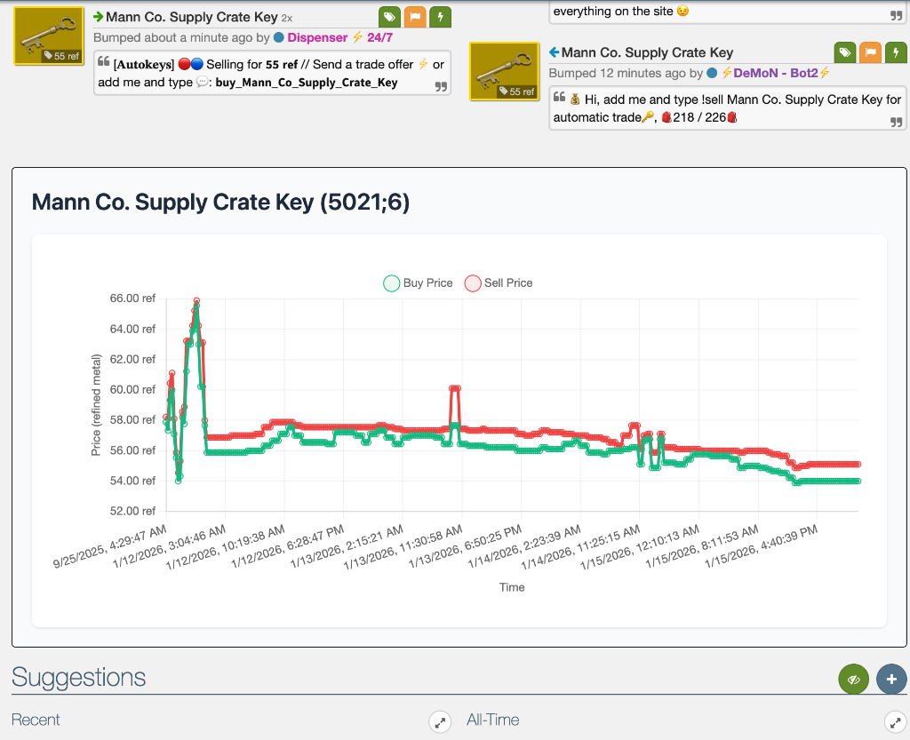

# bptf pricedb graph integration

A simple script that adds [pricedb.io](https://pricedb.io) price history graphs on item pages

## Preview

## How to use

1. Have tampermonkey installed
2. Open bptf-prcedb-graph.user.js in [raw view](https://github.com/purplebarber/bptf-pricedb-graph-integration/raw/refs/heads/main/bptf-pricedb-graph.user.js)
3. Install
